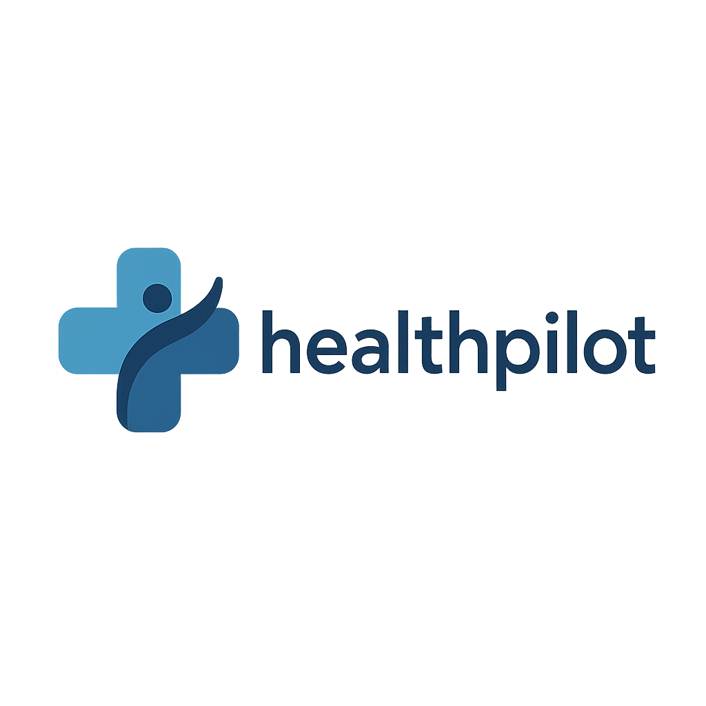
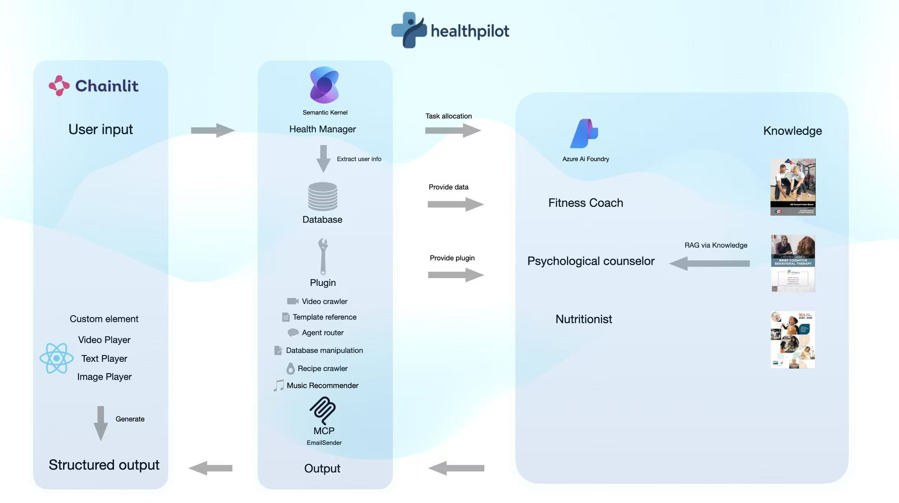

# 🩺 HealthPilot: Your AI-Powered Wellness Companion 🚀

<p align="center">
  
</p>

**Imagine having a personal health assistant available 24/7, ready to guide you on fitness, nutrition, and mental well-being. That's HealthPilot!** We've built an intelligent multi-agent system designed to provide holistic health advice, personalized plans, and helpful resources, all through a friendly chat interface.

Whether you're looking to get fit, eat healthier, or manage stress, HealthPilot acts as your knowledgeable guide, orchestrating specialized AI agents to deliver the best possible support.

## ✨ Features

* **Multi-Agent Architecture:** A central `HealthManager` intelligently routes your requests to specialized agents:
    * 🏋️ **Fitness Agent:** Provides workout advice, exercise demonstrations (using real videos!), and helps create fitness plans.
    * 🍎 **Nutrition Agent:** Offers dietary guidance, finds healthy recipes based on your preferences (scraping from the web!), and breaks down nutritional info.
    * 🧠 **Mental Care Agent:** Supports emotional well-being, suggests calming music (from YouTube!), and provides guidance on stress management and sleep.
* **Interactive UI:** Built with [Chainlit](https://chainlit.io/) for a seamless and engaging chat experience, including custom UI elements for recipes and exercise videos.
* **Personalization:** Remembers user profile details (age, gender, height, weight) using a local SQLite database via the `UserProfileQueryPlugin` to tailor advice (where applicable).
* **External Tool Integration:** Leverages Semantic Kernel plugins to:
    * Scrape websites for fitness videos (`FitnessPlugin` using Playwright).
    * Search and extract recipes (`NutritionPlugin` using Playwright).
    * Find relevant music on YouTube (`MentalCarePlugin` using Pytube).
    * Send email summaries or confirmations (`SmtpPlugin` using Gmail).
    * *(Optional: Add ICS Calendar generation if implemented)*
* **Azure Powered:** Utilizes Azure OpenAI (GPT-4o, GPT-4o-mini) and Azure AI Agents for robust AI capabilities and agent orchestration.
* **RAG-Powered Responses:** Each agent is enhanced with **retrieval-augmented generation (RAG)** using the **Knowledge feature** in Azure AI Foundry's Agent Service — enabling more accurate, grounded, and domain-specific answers.


---

## 🏗️ Architecture

HealthPilot employs a multi-agent architecture coordinated by Semantic Kernel. The user interacts with the Chainlit UI, sending messages to the central `HealthManager` agent. The `HealthManager` analyzes the request and routes it to the appropriate specialist agent (`Fitness`, `Nutrition`, or `MentalCare`). Specialist agents utilize their unique instructions and dedicated plugins (like web scraping, database queries, or music search) to fulfill the request, returning the information to the `HealthManager` and then back to the user via the Chainlit UI.

<p align="center">
  
  <br/><em>Figure 1: HealthPilot System Architecture</em>
</p>

**Core Components:**

* **Chainlit:** Provides the frontend chat interface and manages user sessions.
* **Semantic Kernel:** Orchestrates the overall workflow, manages plugins, and interacts with AI models.
* **Azure AI Agents:** Hosts the specialized agents (Fitness, Nutrition, MentalCare) defined with specific instructions and tools (plugins). Uses GPT-4o.
* **Azure OpenAI Service:** Provides the underlying LLMs (GPT-4o-mini for the `HealthManager`).
* **Plugins:** Modular components (`.py` files in `/plugins`) that give agents specific skills (web scraping, database access, API calls, etc.).

## 🛠️ Tech Stack


## 🚀 Getting Started

Let's get HealthPilot running on your local machine!

### Prerequisites

* **Python:** Version 3.10+ recommended.
* **Git:** To clone the repository.
* **Azure Account & Services:**
    * An active Azure subscription.
    * An Azure OpenAI resource with eg. **GPT-4o-mini** deployed (for the `HealthManager`).
    * An Azure AI Studio/Foundry project with three **Azure AI Agents** created using the eg. **GPT-4o** model (Fitness, Nutrition, MentalCare). Set agent prompts in `agents/*.py` files. Note the `Agent ID` for each. For each agent, upload the corresponding PDF from the `knowledge/` folder into the **Knowledge** section of Azure AI Studio to enable RAG-based responses:

| Agent            | Knowledge PDF File                                      | Description                                |
|------------------|---------------------------------------------------------|--------------------------------------------|
| FitnessAgent     | ACE-Personal-Trainer-Manual-PDFDrive-.pdf              | Exercise science and workout planning      |
| NutritionAgent   | Dietary_Guidelines_for_Americans_2020-2025.pdf         | Official dietary guidance and nutrition    |
| MentalCareAgent  | therapists_guide_to_brief_cbtmanual.pdf                | Cognitive behavioral therapy and mental care |

### Installation & Setup

1.  **Clone the Repository:**
    ```bash
    git clone <your-repository-url>
    cd <repository-directory>
    ```

2.  **Create a Virtual Environment:** (Recommended)
    ```bash
    python -m venv .venv
    source .venv/bin/activate  # Linux/macOS
    # .venv\Scripts\activate  # Windows
    ```

3.  **Install Dependencies:**
    ```bash
    pip install -r requirements.txt
    ```

4.  **Install Playwright Browsers:** (Needed for Nutrition & Fitness plugins)
    ```bash
    playwright install --with-deps
    ```

5.  **Configure Environment Variables:**
    * Create a `.env` file in the project root directory.
    * Add the following variables, replacing placeholder values with your actual credentials:

        ```dotenv
        AZURE_OPENAI_DEPLOYMENT_NAME="gpt-4o-mini" # Or your deployment name
        AZURE_OPENAI_API_KEY="your_aoai_api_key"
        AZURE_OPENAI_ENDPOINT="https://your_aoai_[endpoint.openai.azure.com/](https://endpoint.openai.azure.com/)"
        AZURE_OPENAI_API_VERSION="2024-05-01-preview" # Or your API version
        AZURE_AI_AGENT_PROJECT_CONNECTION_STRING="your_connection_string"
        FITNESS_ASSISTANT="your_fitness_agent_id"
        NUTRITION_ASSISTANT="your_nutrition_agent_id"
        MENTAL_CARE_ASSISTANT="your_mentalcare_agent_id"
        SENDER_EMAIL="your_gmail_address@gmail.com"
        APP_PASSWORD="your_16_character_gmail_app_password"
        CHAINLIT_AUTH_SECRET="your_generated_chainlit_secret" 
        # Generate using: chainlit create-secret
        ```

### Running the Application

1.  **Start Chainlit:**
    ```bash
    chainlit run app.py -w
    ```
    *(The `-w` flag enables auto-reloading during development)*

2.  **Access HealthPilot:**
    * Open your browser and navigate to `http://localhost:8000` (or the port specified by Chainlit).
    * Log in using the simple credentials defined in `app.py` (default: `admin`/`123`) if prompted.

3.  **Start Chatting!** Use the starter prompts or ask your own health-related questions.

## ☁️ Deployment

Refer the below link to test the application:

Project Link: https://healthpilot-ebb2fue5ewbegcgv.eastus2-01.azurewebsites.net

## 💡 Future Improvements

* **Persistent & Scalable Storage:** Replace SQLite with a cloud database (e.g., Azure SQL, Cosmos DB) for user profiles.
* **Enhanced Personalization:** Track progress, preferences, and provide proactive recommendations.
* **Wearable Integration:** Connect with fitness trackers or health APIs.
* **Calendar Integration:** Implement direct calendar event creation (using `.ics` generation or potentially MS Graph/Google Calendar API).
* **More Modalities:** Explore image analysis (e.g., food logging) or voice input.

## 🙏 Acknowledgements

* The [Semantic Kernel](https://github.com/microsoft/semantic-kernel) team for the powerful orchestration framework.
* The [Chainlit](https://chainlit.io/) team for the awesome chat UI library.
* Azure AI and OpenAI for the cutting-edge AI models.

## Team
- **Yushuhong Lin** ([ylin766](https://github.com/ylin766))
- **Akhil Deshneni** ([deshneni-akhil](https://github.com/deshneni-akhil))
